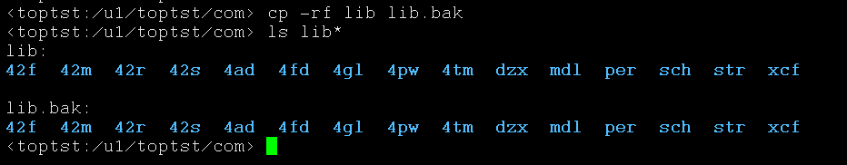
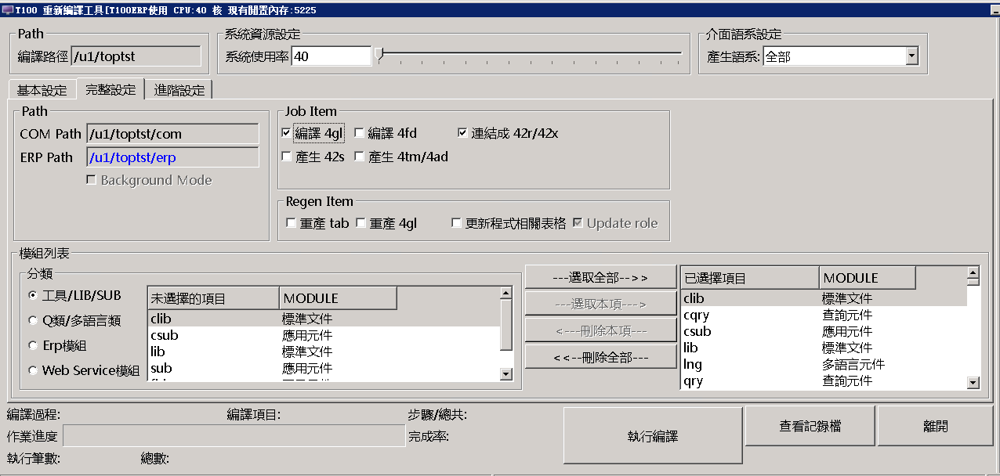
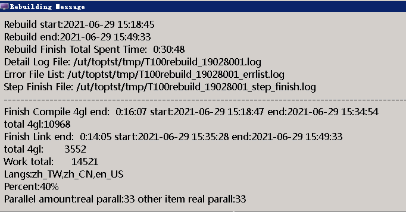
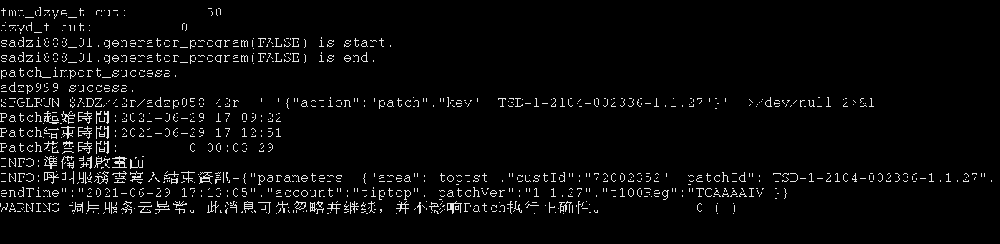
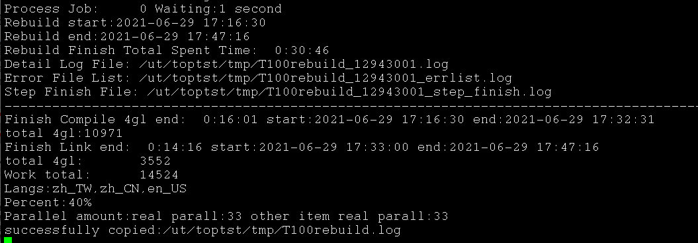

## 更新patch 工具

## 备份lib目录 
cp -rf lib lib.bak 

## 进行rebuild 保证现在系统正常

## 进行patch更新
> sqlplus ds/ds < updata.sql

<!-- error -->
summary-ERROR:
ERROR:程式cl_schedule在r.c出???: 
The compilation was not successful.  Errors found: 32. 
/u1/toptst/com/lib/42m/lib_cl_schedule.4gl:391:42:391:51:error:(-4335) The symbol 'l_dataonly' is not an element of the record 'g_schedule_d'. 
/u1/toptst/com/lib/42m/lib_cl_schedule.4gl:392:42:392:45:error:(-4335) The symbol 'l_HF' is not an element of the record 'g_schedule_d'. 
/u1/toptst/com/lib/42m/lib_cl_schedule.4gl:432:36:432:45:error:(-4335) The symbol 'l_dataonly' is not an element of the record 'g_schedule_d'. 
/u1/toptst/com/lib/42m/lib_cl_schedule.4gl:433:36:433:39:error:(-4335) The symbol 'l_HF' is not an element of the record 'g_schedule_d'. 
/u1/toptst/com/lib/42m/lib_cl_schedule.4gl:487:36:487:42:error:(-4335) The symbol 'gzpe013' is not an element of the record 'g_schedule_d'. 
/u1/toptst/com/lib/42m/lib_cl_schedule.4gl:538:36:538:45:error:(-4335) The symbol 'l_dataonly' is not an element of the record 'g_schedule_d'. 
/u1/toptst/com/lib/42m/lib_cl_schedule.4gl:539:36:539:39:error:(-4335) The symbol 'l_HF' is not an element of the record 'g_schedule_d'. 
/u1/toptst/com/lib/42m/lib_cl_schedule.4gl:686:58:686:64:error:(-4335) The symbol 'gzpe013' is not an element of the record 'g_schedule_d'. 
/u1/toptst/com/lib/42m/lib_cl_schedule.4gl:686:95:686:101:error:(-4335) The symbol 'gzpe013' is not an element of the record 'g_schedule_d'. 
/u1/toptst/com/lib/42m/lib_cl_schedule.4gl:712:36:712:45:error:(-4335) The symbol 'l_dataonly' is not an element of the record 'g_schedule_d'. 
/u1/toptst/com/lib/42m/lib_cl_schedule.4gl:713:36:713:39:error:(-4335) The symbol 'l_HF' is not an element of the record 'g_schedule_d'. 
/u1/toptst/com/lib/42m/lib_cl_schedule.4gl:734:32:734:35:error:(-4335) The symbol 'l_HF' is not an element of the record 'g_schedule_d'. 
/u1/toptst/com/lib/42m/lib_cl_schedule.4gl:735:36:735:45:error:(-4335) The symbol 'l_dataonly' is not an element of the record 'g_schedule_d'. 
/u1/toptst/com/lib/42m/lib_cl_schedule.4gl:739:32:739:35:error:(-4335) The symbol 'l_HF' is not an element of the record 'g_schedule_d'. 
/u1/toptst/com/lib/42m/lib_cl_schedule.4gl:741:36:741:45:error:(-4335) The symbol 'l_dataonly' is not an element of the record 'g_schedule_d'. 
/u1/toptst/com/lib/42m/lib_cl_schedule.4gl:891:33:891:42:error:(-4335) The symbol 'l_dataonly' is not an element of the record 'g_schedule_d'. 
/u1/toptst/com/lib/42m/lib_cl_schedule.4gl:892:33:892:36:error:(-4335) The symbol 'l_HF' is not an element of the record 'g_schedule_d'. 
/u1/toptst/com/lib/42m/lib_cl_schedule.4gl:899:33:899:42:error:(-4335) The symbol 'l_dataonly' is not an element of the record 'g_schedule_d'. 
/u1/toptst/com/lib/42m/lib_cl_schedule.4gl:900:33:900:36:error:(-4335) The symbol 'l_HF' is not an element of the record 'g_schedule_d'. 
/u1/toptst/com/lib/42m/lib_cl_schedule.4gl:909:36:909:45:error:(-4335) The symbol 'l_dataonly' is not an element of the record 'g_schedule_d'. 
/u1/toptst/com/lib/42m/lib_cl_schedule.4gl:910:36:910:39:error:(-4335) The symbol 'l_HF' is not an element of the record 'g_schedule_d'. 
/u1/toptst/com/lib/42m/lib_cl_schedule.4gl:3754:56:3754:62:error:(-4335) The symbol 'gzpe013' is not an element of the record 'g_schedule_d'. 
/u1/toptst/com/lib/42m/lib_cl_schedule.4gl:5146:34:5146:43:error:(-4335) The symbol 'l_dataonly' is not an element of the record 'g_schedule_d'. 
/u1/toptst/com/lib/42m/lib_cl_schedule.4gl:5147:37:5147:40:error:(-4335) The symbol 'l_HF' is not an element of the record 'g_schedule_d'. 
/u1/toptst/com/lib/42m/lib_cl_schedule.4gl:5155:34:5155:43:error:(-4335) The symbol 'l_dataonly' is not an element of the record 'g_schedule_d'. 
/u1/toptst/com/lib/42m/lib_cl_schedule.4gl:5156:37:5156:40:error:(-4335) The symbol 'l_HF' is not an element of the record 'g_schedule_d'. 
/u1/toptst/com/lib/42m/lib_cl_schedule.4gl:5167:148:5167:154:error:(-4335) The symbol 'gzpe013' is not an element of the record 'g_schedule_d'. 
/u1/toptst/com/lib/42m/lib_cl_schedule.4gl:5232:30:5232:39:error:(-4335) The sERROR:程式azzi000在r.l出???: 
ERROR(-1338):The function 'cl_process_del_gzwl' has not been defined in any module in the program. 
ERROR : Link error. 
Error: 作? /u1/toptst/erp/azz/42r/azzi000.42r 建置失?,回放原有42r?!
ERROR:程式azzq080在r.l出???: 
ERROR(-1338):The function 'cl_process_del_gzwl' has not been defined in any module in the program. 
ERROR : Link error. 
Error: 作? /u1/toptst/erp/azz/42r/azzq080.42r 建置失?,回放原有42r?!
BREAK_ERROR

<!-- error  -->

