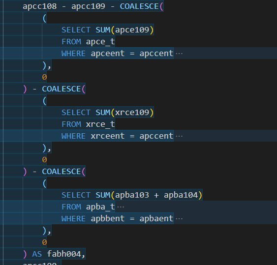
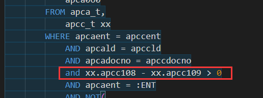
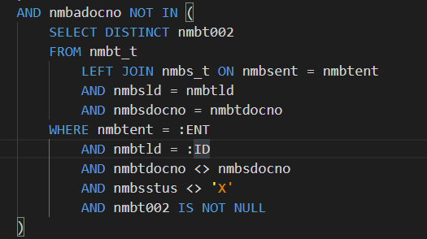

## T100 开窗效能优化案例分享
> 随着客户的单据量增加，部分作业开窗效能会越来越慢。如aapt420冲帐单，如果某个客户的单据量非常多的时候，那么开窗就会异常的慢。
> 开窗如果在10S以内，用户还能勉强接受，如果常用的作业开窗达到1分钟，2分钟就会非常影响日常使用。换位思考，你打开一个开窗需要2分钟，期间你会做什么...

### 产生原因
1. 单据量变大，开窗一般会关联两个作业的表，当前作业，和需要录入的单据作业。
2. 部分客户单据异常的多，如EMPL，部分客户可能依赖这些交易对象编号，资料非常多，但其它交易对象编号开窗正常。
3. 客户有客制，和标准不一样，逻辑比较复杂


### 案例分析

#### 案例1 

士兴aapt420开窗慢，只有编号EPML，而且在SX02据点中中才会慢。

开窗中原SQL
```sql
SELECT DISTINCT apca001,
    apcald,
    apcadocno,
    apccseq,
    apcc001,
    apcc009,
    apca057,
    ooag011,
    apcc100,
    fabh004,
    apcastus,
    apca053,
    apca033
FROM (
        SELECT DISTINCT apca001,
            apcald,
            apcadocno,
            apccseq,
            apcc001,
            apcc009,
            apca057,
            apca038,
            apca004,
            apca053,
            apca033,
            apcc108 - apcc109 - COALESCE(
                (
                    SELECT SUM(apce109)
                    FROM apce_t
                    WHERE apceent = apccent
                        AND apceld = apccld
                        AND NOT (
                            apce001 = 'aapt430'
                            AND EXISTS (
                                SELECT 1
                                FROM apca_t
                                WHERE apcaent = apceent
                                    AND apcadocno = apce003
                                    AND apcald = apceld
                                    AND apca001 LIKE '1%'
                            )
                        )
                        AND apce003 = apccdocno
                        AND apce004 = apccseq
                        AND apce005 = apcc001
                        and (
                            exists (
                                select 1
                                from apda_t
                                where apceent = apdaent
                                    and apceld = apdald
                                    and apcedocno = apdadocno
                                    and apdastus NOT IN('X', 'Y')
                            )
                            OR exists (
                                select 1
                                from apca_t
                                where apceent = apcaent
                                    and apceld = apcald
                                    and apcedocno = apcadocno
                                    and apcastus NOT IN('X', 'Y')
                            )
                        )
                ),
                0
            ) - COALESCE(
                (
                    SELECT SUM(xrce109)
                    FROM xrce_t
                    WHERE xrceent = apccent
                        AND xrceld = apccld
                        AND xrce003 = apccdocno
                        AND xrce004 = apccseq
                        AND xrce005 = apcc001
                        and (
                            exists (
                                select 1
                                from xrda_t
                                where xrceent = xrdaent
                                    and xrceld = xrdald
                                    and xrcedocno = xrdadocno
                                    and xrdastus NOT IN('X', 'Y')
                            )
                        )
                ),
                0
            ) - COALESCE(
                (
                    SELECT SUM(apba103 + apba104)
                    FROM apba_t
                        LEFT JOIN apbb_t ON apbaent = apbbent
                        AND apbadocno = apbbdocno
                    WHERE apbbent = apbaent
                        AND apbaent = apccent
                        AND apba005 = apccdocno
                        AND apba006 = apccseq
                        AND apba020 = apcc001
                        AND (
                            apbbstus NOT IN ('X', 'Y')
                            OR (
                                apbbstus = 'Y'
                                AND NOT EXISTS (
                                    SELECT apca018
                                    FROM apca_t
                                    WHERE apcaent = apccent
                                        AND apbbdocno = apca018
                                        AND apcastus <> 'X'
                                )
                            )
                        )
                ),
                0
            ) AS fabh004,
            apcc100,
            apcastus,
            apcaent,
            apcacomp,
            apca005,
            apcadocdt,
            apca060
        FROM apca_t,
            apcc_t xx
        WHERE apcaent = apccent
            AND apcald = apccld
            AND apcadocno = apccdocno
            and xx.apcc108 - xx.apcc109 > 0
            AND apcaent = :ENT
            AND NOT(
                apca001 like '2%'
                AND EXISTS(
                    select 1
                    from apca_t,
                        apcc_t
                    where apcaent = apccent
                        and apcastus = 'Y'
                        AND apcadocno = apccdocno
                        AND apcaent = apccent
                        and apcald = apccld
                        and apcc108 - apcc109 > 0
                        and apca019 = xx.apccdocno
                        and apcald = xx.apccld
                        and apcaent = xx.apccent
                )
            )
    )
    LEFT JOIN ooag_t ON ooagent = apcaent
    AND ooag001 = apca057
WHERE apcaent = :ENT
    AND fabh004 > 0
    AND apcastus = 'Y'
    AND (apca005 = 'arg2')
    AND apcadocdt <= 'arg3'
ORDER BY apca001,
    apcald,
    apcadocno,
    apccseq,
    apcc001
```


将无关的where去掉就会发现，效率很快。sql中比较复杂的部分是下图这个部分，关联了多个表，单据是否已经在其它单据中录入，没有审核。
虽然逻辑没问题，但是实际业务中，录入未审核的单据很少。



所以我的优化方案是，增加一个条件，如果多账期中判断冲完，就不需要再查询是否有未审核的冲账单。

> sql中语句运行顺序是 where条件运行 优先于select 查询中的sql


#### 案例2 
伯特利 anmt311 开窗慢，所有条件开窗都慢。

原sql 

```sql
SELECT DISTINCT nmbadocno,
    nmbadocdt,
    nmbasite,
    a.ooefl003,
    nmba002,
    ooag011,
    nmbacomp,
    b.ooefl003
FROM   nmba_t
    LEFT JOIN ooefl_t a ON a.ooeflent = nmbaent
    AND a.ooefl001 = nmbasite
    AND a.ooefl002 = :DLANG
    LEFT JOIN ooag_t ON ooagent = nmbaent
    AND ooag001 = nmba002
    LEFT JOIN ooefl_t b ON b.ooeflent = nmbaent
    AND b.ooefl001 = nmbacomp
    AND b.ooefl002 = :DLANG 
WHERE nmbaent = :ENT 
    AND (
        nmbastus = 'V'
        OR nmbastus = 'Y'
    )
    AND nmbadocno NOT IN (
        SELECT DISTINCT nmbt002
        FROM nmbt_t
            LEFT JOIN nmbs_t ON nmbsent = nmbtent
            AND nmbsld = nmbtld
            AND nmbsdocno = nmbtdocno
        WHERE nmbtent = :ENT
            AND nmbtld = :ID
            AND nmbtdocno <> nmbsdocno
            AND nmbsstus <> 'X'
            AND nmbt002 IS NOT NULL
    )
ORDER BY nmbadocno
```


去掉 where 就能发现主要是这段影响效能，这段是g_qryparam.where中的条件，与r.q 开窗无关。
因为这个开窗涉及作业不止一个，所以另外新增一个开窗改写条件。

优化的方向就是将`NOT IN` 改写为`LEFT JOIN` 
>  `IN`， `NOT IN`， `EXISTS`， `NOT EXISTS`  原理上都能改写为`LEFT JOIN` 形式

优化后的SQL
```sql
SELECT DISTINCT nmbadocno,
    nmbadocdt,
    nmbasite,
    a.ooefl003,
    nmba002,
    ooag011,
    nmbacomp,
    b.ooefl003
FROM nmba_t
    LEFT JOIN ooefl_t a ON a.ooeflent = nmbaent
    AND a.ooefl001 = nmbasite
    AND a.ooefl002 = :DLANG
    LEFT JOIN ooag_t ON ooagent = nmbaent
    AND ooag001 = nmba002
    LEFT JOIN ooefl_t b ON b.ooeflent = nmbaent
    AND b.ooefl001 = nmbacomp
    AND b.ooefl002 = :DLANG
    left join (
        select nmbt002 nmbt002_1
        from nmbt_t,
            nmbs_t
        WHERE nmbtent = :ENT
            and nmbsent = nmbtent
            AND nmbsld = nmbtld
            AND nmbsdocno = nmbtdocno
            AND nmbtld = 'arg1'
            AND nmbtdocno <> 'arg2'
            AND nmbsstus <> 'X'
            AND nmbt002 IS NOT NULL
    ) on nmbt002_1 = nmbadocno
WHERE nmbaent = :ENT
    and nmbt002_1 is null
    AND (
        nmbastus = 'V'
        OR nmbastus = 'Y'
    )
ORDER BY nmbadocno
```
> 需要注意的是，`LEFT JOIN` 中的需要保证只有一个结果，不能保证的话，需要加上`DISTINCT` `UNIQUE`关键字，否则会影响最终结果唯一性。


**可以在开窗效能的案件中尝试一下，这两种办法，有任何建议还原反馈，之后遇到其它案例也会再分享。
参考中遇到问题可以联系我咨询**

TO BE CONTINUE...
