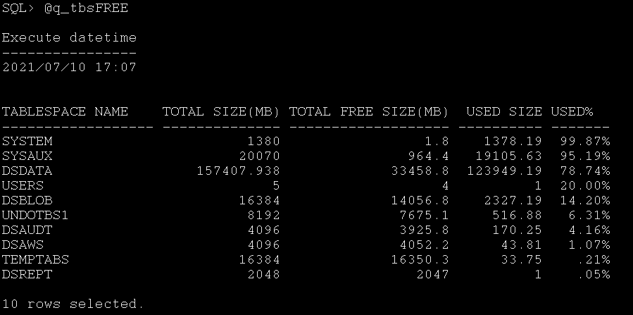
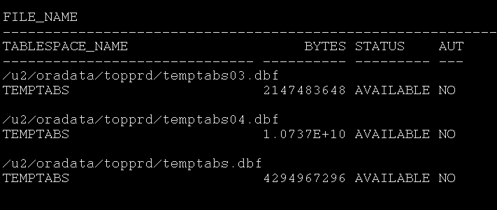
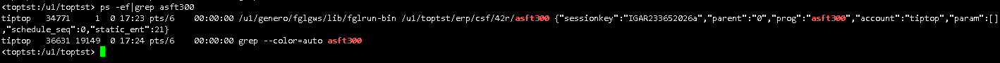
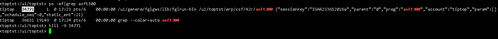
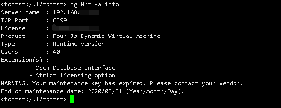
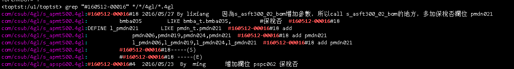
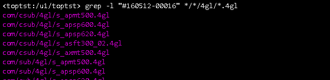
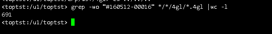
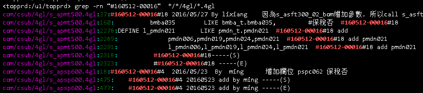

# 常用命令分享

## **增加表空间**
1. 查询表空间剩余空间是否足够 

`sqlplus system/******@topprd`

`@q_tbsFREE`

2. 查询历史表空间文件名称

`@q_datafile`

3. 增加表空间
`alter tablespace TEMPTABS add datafile '/u2/oradata/topprd/temptabs05.dbf' size 4G;`

`TEMPTABS` 为需要增加的表空间名称，`/u2/oradata/topprd/temptabs05.dbf` 为`q_datafile`中最大编号+1。（不重复即可）

## **杀掉作业进程**

1. 查询进程PID

`ps -ef|grep `

2. 根据PID结束进程

`kill -9 PID`

## **fglWrt 授权查询**
`fglWrt -a info`

查询用户授权情况

## **sed 截取文件**

`sed -n '100,200p'  123.xml >> 12.xml `
将`123.xml` 中从100行到200行内容复制到`12.xml`这个文件中。
> 用处：大文件日志，不方便下载，其中的报文又不好复制的时候，可以用这个命令将需要的内容切割出来.

## **grep 命令**
 
`grep`  参数 关键字 文件名

直接用就是查询所有匹配内容

### 参数 -l

`grep -l "hello,world!"  file_name`

### 参数 -wo
`grep -wo "keyword" filename |wc -l`

> 用处：我常用这个查询某个追单一共有多少处

### 参数 -rn

>`grep -rn "hello,world!"  file_name` 

这个参数可以查询匹配的文件名和所在行数 
 
 
## **效能工具**
### T100 

1. 直接运行命令 `r.h axcp500`
   
### GP 

1.  直接运行命令`r.r2d+ axcp500`

2. 运行不了`r.r2d+`可以尝试命令 `r.r2d axcp500`，该命令会在作业所在目录生成一个log，`axcp500.log`。使用命令 `$DS4GL/bin/fgldebug axcp500.log` 继续进行效能分析

TO BE CONTINUE ...
