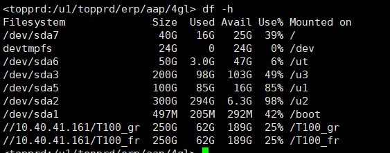
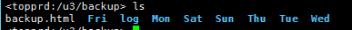
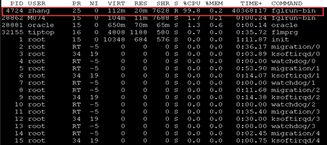
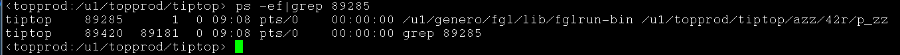
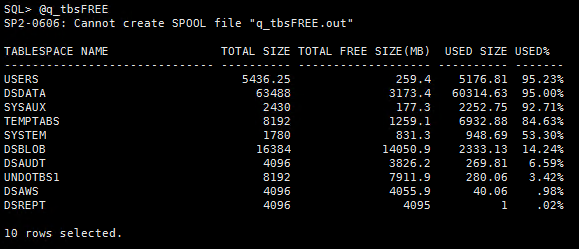
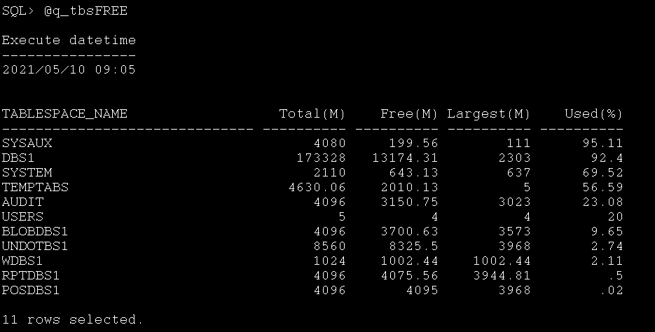

## 1. 磁盘空间使用状况
> tiptop 帐号运行命令 `df -h`

> 检查项目
 
|目录|作用|超90%处理办法|其它|
|:-:|:-|:-|:-|
|`/`|linux系统目录|先清理无用大文件，再判断是否需要扩容||
|`/u1`|ERP系统文件|清理无用大文件|TOPGP临时日志在此目录|
|`/u2`|数据库文件|扩容或者使用其它目录新建数据库表空间||
|`/u3`|备份文件|建议客户扩容|使用稳定的话也不需要扩容|
|`/ut`|日志|建议客户扩容|GP没有此目录，T100的7天日志备份也在此目录|

## 2. 系统备份状态
> /u3/backup 目录保存7天备份

查看文件夹内部备份文件是否正常
> 检查项目

检查下列文件是否正常生成

|文件名|文件内容|版本|备注|
|:-|:-|:-|:-|
|`dsdata.dmp.gz`|数据库备份|T100|部分客户是`dsdemo`|
|`ds.dmp.gz`|ds数据库备份|T100||
|`dsaws(t).dmp.gz`|集成中间数据库备份|T100|
|`topprd.tgz`|程序备份|T100|
|`genero.tgz`|ERP系统备份|T100/GP| |
|`exp_XX_YYYYMMDD.dmp.gz`|数据备份|GP|XX是账套代码，YYYYMMDD是日期|
|`tiptop.tar.gz`/`topcust.tar.gz`|程序备份|GP|| 

> 未生成处理办法
1. GP 根据backup.log文件排查报错原因
2. T100 根据 exp_dsdata.log文件排查报错原因

## 3. TIPTOP 疑似死进程
> `tiptop`账号运行命令 `top`，之后输入大写`T`按照运行时间排序

> 排查范围

`COMMAND` 命令为`fglrun-bin` 的进程，运行超过24小时
根据PID找到对应运行的作业

> 建议处理
> 
`kill -9 PID` 终止异常进程

理论上没有任何作业需要24小时运行，如果不确定可以和客户先确认下。

## 4. 表空间使用状况
> system用户连接到数据库
运行命令`@q_tbsFREE`

**T100**

**TOPGP**

> 排查范围

|表名|作用|预警范围|处理办法|版本|备注|
|:-|:-|:-|:-|:-|:-|
|DSDATA|主要资料表空间|已使用超90%|增加表空间|T100||
|DSBLOB|一般存储附件中的文件|已使用超90%|增加表空间|T100||
|DSREPPT|存储报表相关资料|已使用超90%|增加表空间|T100||
|DSAWS|存储接口中间表资料|已使用超90%|增加表空间|T100||
|TEMPTABS|临时表空间|最大可连续扩展空间不足10M，或使用超90%|增加表空间|T100/TOPGP||
|DBS1|主要资料表空间|已使用超90%|增加表空间|TOPGP||
|BLOBDBS1|一般存储附件中的文件|已使用超90%|增加表空间|TOPGP||
|RPTDBS1|存储报表相关资料|已使用超90%|增加表空间|TOPGP||
 